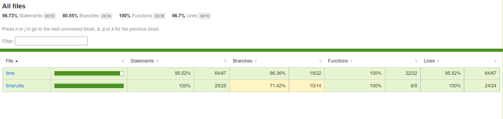

# Time-clocks

### This repository created about a task of creating a **time** class and extend it to another classes such as **clock** and **stopper**  

---

#### In this project iv'e practiced about improving my experiences with:

-   [x] **Classes** : iv'e created classes with methods, getters, setters, in order to implement the specified classes logics.
-   [x] **Inheritance** : the inheritance from **Time** class to another classes such as: **clock**, **stopper** allowed me to preserve the initial time logic in my project and help the other classes to be written with less code, and easier maintenance if needed.
-   [x] **Test-writing** : as you can see there are tests that cover any function and method that have been written inside this project, in order to make sure all of the classes and util function's all works well, and to provide full coverage :  

 

#### You can get more information about the task inside my project in the file: "time-task.pdf" (written in hebrew).

### Another point that i would like to mention:

-   This project & tests were written with **high strictness**, and they passed my mentor's high standarts after me **refactoring this project's logic and tests a few times in order to make it easy to read and maintain** as much as possible.
